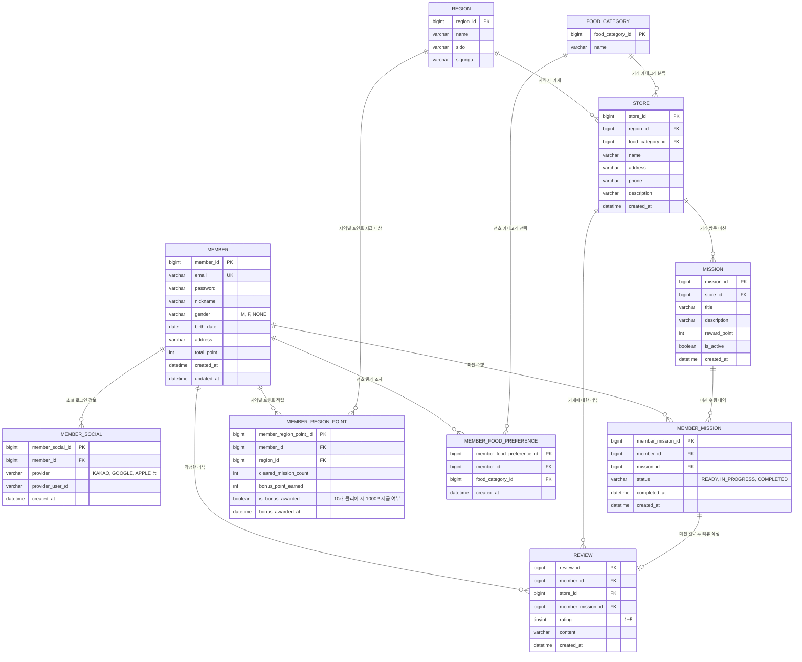

# ERD - 지역 기반 미션 리워드 서비스

## 서비스 요약
각 지역별로 가게들이 있으며, 가게를 방문하는 미션을 해결하고 포인트를 모으는 리워드 서비스.
(모든 지역마다 10개의 미션 클리어 시 1,000 Point 부여)

## IA / 와이어프레임 분석 메모
- **Onboarding → 로그인 → (N)회원가입 → 선호 조사 → 홈**: 회원가입 시 닉네임·성별·생년월일·주소를 입력하고, 가입 직후 선호 음식 카테고리를 조사함.
- **홈**: "내가 받은 미션" 진행 현황(예: 7/10)을 보여줌 → 지역별 클리어 카운트 설계와 연결.
- **미션 탭**: 수행중인 미션 / 완료한 미션 / **리뷰 작성**으로 구성 → 필수 요구사항 목록에는 없지만 와이어프레임에 실존하는 화면이라 `review` 테이블을 추가함.
- **지도 탭**: 가게 리스트 / 가게 정보 → `store` 테이블로 커버(지도 자체의 위치·검색 기능만 PASS).
- **마이페이지**: 내 포인트, 내 정보 변경, 도움말, 로그아웃, 계정탈퇴 → "내 포인트 관리·알림 설정"은 PASS 대상이라 상세 내역/알림 테이블은 설계 제외.

## 설계 범위
- 포함: 로그인/회원가입(선호 조사 포함), 홈 화면(지역/가게 정보), 미션 목록·수행 내역, 리뷰 작성
- 제외(PASS): 지도 및 검색 기능, 내 포인트 관리 및 알림 설정 기능, 사장님 점포 관리 화면

## ERD (Mermaid)

## 테이블 설명

| 테이블 | 설명 |
|---|---|
| `member` | 회원 기본 정보(닉네임·성별·생년월일·주소 등) 및 누적 포인트 |
| `member_social` | 회원의 소셜 로그인 연동 정보 (1:N, 여러 소셜 계정 연동 가능) |
| `member_food_preference` | 가입 직후 선호 조사에서 선택한 음식 카테고리 (회원 N : 카테고리 N) |
| `region` | 지역 정보 (홈 화면에서 지역별 가게를 보여주기 위한 기준) |
| `food_category` | 음식 카테고리 (가게 분류 및 회원 선호 조사에 공용으로 사용) |
| `store` | 지역에 속한 가게 정보 |
| `mission` | 가게를 방문해 수행하는 미션 (가게 1개는 미션 여러 개를 가질 수 있음) |
| `member_mission` | 회원별 미션 수행 내역 (상태값으로 진행 여부 관리) |
| `review` | 미션 완료 후 가게에 남기는 리뷰(별점 + 텍스트) |
| `member_region_point` | 회원이 지역별로 미션을 몇 개 클리어했는지, 10개 클리어 시 보너스 1,000P 지급 여부를 관리 |

## 설계 메모
- **지역당 10개 미션 클리어 → 1,000P 지급** 규칙은 `member_mission`의 `COMPLETED` 건수를 직접 세는 대신, `member_region_point`에 지역별 클리어 카운트와 보너스 지급 여부를 별도로 저장해 중복 지급을 방지하고 조회 성능을 확보했어요. 홈 화면의 "7/10" 진행 표시도 이 테이블의 `cleared_mission_count`로 바로 계산돼요.
- 선호 조사는 회원 1명이 음식 카테고리를 여러 개 고를 수 있는 다대다 관계라 `member_food_preference` 중간 테이블로 분리하고, 가게 분류에 쓰는 `food_category`를 그대로 재사용했어요.
- 리뷰는 와이어프레임의 "완료한 미션 → 리뷰 작성" 흐름을 반영해 `member_mission`과 1:1(선택)로 연결했어요 — 미션을 완료해야만 리뷰를 남길 수 있다는 제약을 구조로 표현.
- 지도/검색, 알림 설정, 사장님 점포 관리 화면은 요구사항에서 PASS 대상이라 이번 ERD에서 제외했어요.
- 소셜 로그인은 한 회원이 여러 provider를 연동할 수 있다고 가정해 `member_social`을 별도 테이블로 분리했어요 (일반 회원가입만 쓰는 경우 `member`에 `provider` 컬럼만 둬도 무방).
